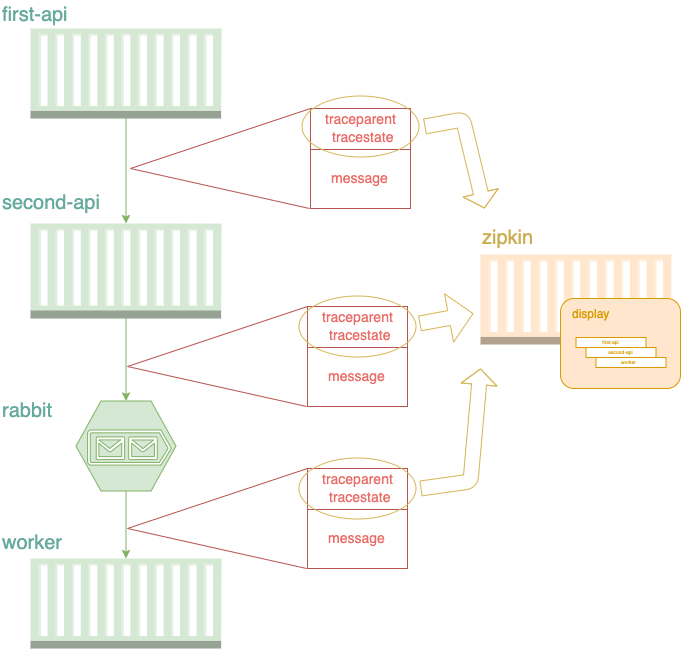
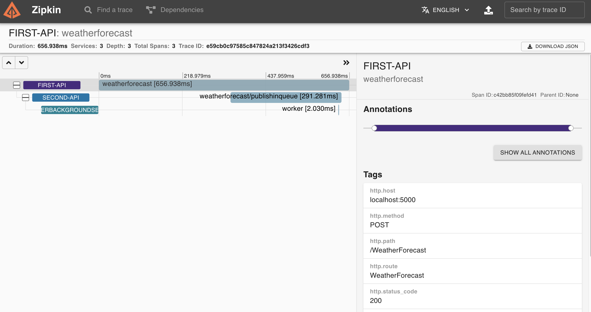

# [c#] Using W3C Trace Context standard in distributed tracing

In my last [article](https://dev.to/luizhlelis/using-w3c-trace-context-standard-in-distributed-tracing-3743), I wrote about the W3C trace context standard and what kind of problem it came to solve. The current article purpose is to show the trace context usage in a microservice architecture. For the first practical example, I chose to develop all aplications using c# with `.NET 5` and up all of them locally via docker-compose. Hope you enjoy it!

System that shows a [W3C trace context](https://www.w3.org/TR/trace-context) and [AMQP W3C trace context](https://w3c.github.io/trace-context-amqp/#traceparent-amqp-format) example in `.NET 5`. I choose the [sample WeatherForecast API](https://docs.microsoft.com/aspnet/core/tutorials/first-web-api?view=aspnetcore-5.0&tabs=visual-studio) to develop this POC.

## Trace context propagation through http calls

As the standard recomends, fields `traceparent` and `tracestate` SHOULD be added in the request header.

## Trace context propagation through AMQP calls

As the standard recomends, fields `traceparent` and `tracestate` SHOULD be added to the message in the `application-properties` section by message publisher. Message reader SHOULD construct the full trace context by reading `traceparent` and `tracestate` fields from the `message-annotations` first and if not exist - from `application-properties`.

Nevertheless, as Trace context for AMQP standard is very recent, not all packages and libraries are updated to deal with `traceparent` and `tracestate` propagation, that's the reason why OSS libraries like [NServiceBus](https://github.com/Particular/NServiceBus) or also [Opentelemetry](https://github.com/open-telemetry/opentelemetry-dotnet/blob/main/examples/MicroserviceExample/Utils/Messaging/MessageReceiver.cs#L91) add them in the message header. This application follows the libraries examples adding `traceparent` in the message header.

## Application architecture

The purpose here is to propagate a message with `traceparent` id throw two api's and one worker usign [W3C trace context](https://www.w3.org/TR/trace-context) standard. The `first-api` calls the `second-api` by a http call, on the other hand, the `second-api` has an asynchronous communication with the `worker` by a message broker (I chose [rabbitmq](https://www.rabbitmq.com/) for that). Furthermore, I chose [zipkin](https://zipkin.io/) as default APM tool, being responsible for get the application traces and build the distributed tracing diagram.



The first and second APIs have the [same code base](./src/OpenTelemetryApi), but they're deployed in different containers.

## Running the project

Inside [src folder](./src), type the command below to up all containers (`first-api`, `second-api`, `worker`, `rabbit` and `zipkin`):

```bash
  docker-compose up
```

wait for all containers get on and then send a request to the `first-api`:

```bash
curl --request POST \
  --url http://localhost:5000/WeatherForecast \
  --header 'Content-Type: application/json' \
  --header 'accept: */*' \
  --data '{
	"temperatureC": 10,
	"summary": "Trace Test"
}'
```

the message that you sent above will travel throughout the flow (`first-api` > `second-api` >  `rabbit` > `worker`) along with the propagation fields (`traceparent` and `tracestate`). To see the generated distributed tracing diagram, access `zipkin` in your browser:

```bash
  http://localhost:9411/
```

at home page, let the search field empty and type `RUN QUERY` to load all traces. Finally, click in your trace, then you'll see a diagram like this:


