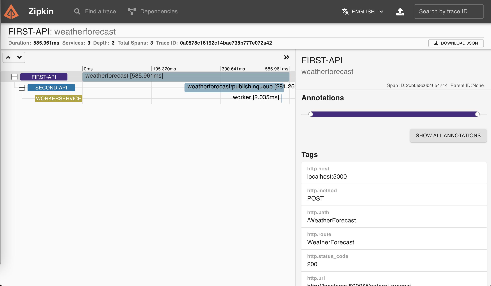

# [c#] Using W3C Trace Context standard in distributed tracing

In my last [article](https://dev.to/luizhlelis/using-w3c-trace-context-standard-in-distributed-tracing-3743), I wrote about the W3C trace context standard and what kind of problem it came to solve. The current article purpose is show the trace context usage in a microservice architecture. For the first practical example, I chose to develop all aplications using c# with `.NET 5` ([sample WeatherForecast web API](https://docs.microsoft.com/aspnet/core/tutorials/first-web-api?view=aspnetcore-5.0&tabs=visual-studio)) and run all of them locally via docker-compose. Hope you enjoy it!

## Application architecture

The main objective is to propagate a message with `traceparent` id throw two api's and one worker usign [W3C trace context](https://www.w3.org/TR/trace-context) standard. The `first-api` calls the `second-api` by a http call, on the other hand, the `second-api` has an asynchronous communication with the `worker` by a message broker ([rabbitmq](https://www.rabbitmq.com/) was choosen for that). Furthermore, [zipkin](https://zipkin.io/) was the trace system chosen (or `vendor` as the standard call it), being responsible for get the application traces and build the distributed tracing diagram:

### <a name="firstfigure"></a>Figure 1 - Distributed trace


the first and second APIs have the [same code base](../src/OpenTelemetryApi), but they're deployed in different containers.

## OpenTelemetry

An important framework used in the present article to deal with the different traces is [OpenTelemetry](https://opentelemetry.io/). As the documentation saids:

> OpenTelemetry is a set of APIs, SDKs, tooling and integrations that are designed for the creation and management of telemetry data such as traces, metrics, and logs.

[OTel](https://opentelemetry.io/docs/concepts/glossary/) provides a vendor-agnostic instrumentation library to generate, emit, collect, process and export telemetry data. That's not only the only purpose of `OTel`, which is composed by multiple components: proto, specification, collector, instrumentation libraries; but that's subject for other article.

`W3C TraceContext` is one of the [propagators](https://github.com/open-telemetry/opentelemetry-specification/blob/b46bcab5fb709381f1fd52096a19541370c7d1b3/specification/context/api-propagators.md#propagators-distribution) maintained and distributed as extension packages by `OTel`. That's the reason why `OTel` is aways related to `W3C TraceContext` and vice versa.

## Talk is cheap, show me the code

The default diagnostics library in `.NET 5`, called [System.Diagnostics](https://docs.microsoft.com/en-us/dotnet/api/system.diagnostics?view=net-5.0), is already prepared to propagate the context based on W3C TraceContext specification. In previous `.NET Core` versions, the context was propagated with an [hierarchical identifier format](https://github.com/dotnet/runtime/blob/main/src/libraries/System.Diagnostics.DiagnosticSource/src/ActivityUserGuide.md#id-format) by default. On `.NET Core 3.0`, the identifier format setup started to be available, see [this](https://stackoverflow.com/questions/61251914/how-can-i-access-w3c-tracecontext-headers-in-a-net-core-3-1-application/67086305#67086305) stackoverflow question for more information about how to configure w3c's format in previous `.NET Core` versions.

The `first-api` and the `second-api` showed in [Figure 1](#firstfigure) requires three packages to work properly with `OpenTelemetry`:

``` csharp
    <PackageReference Include="OpenTelemetry.Extensions.Hosting" Version="1.0.0-rc2" />
    <PackageReference Include="OpenTelemetry.Instrumentation.AspNetCore" Version="1.0.0-rc2" />
    <PackageReference Include="OpenTelemetry.Exporter.Zipkin" Version="1.0.1" />
```

## Running the project

Inside [src folder](./src), type the command below to up all containers (`first-api`, `second-api`, `worker`, `rabbit` and `zipkin`):

```bash
  docker-compose up
```

wait for all containers get on and then send a request to the `first-api`:

```bash
curl --request POST \
  --url http://localhost:5000/WeatherForecast \
  --header 'Content-Type: application/json' \
  --header 'accept: */*' \
  --data '{
	"temperatureC": 10,
	"summary": "Trace Test"
}'
```

the message that you sent above will travel throughout the flow (`first-api` > `second-api` >  `rabbit` > `worker`) along with the propagation fields (`traceparent` and `tracestate`). To see the generated distributed tracing diagram, access `zipkin` in your browser:

```bash
  http://localhost:9411/
```

at home page, let the search field empty and type `RUN QUERY` to load all traces. Finally, click in your trace, then you'll see a diagram like this:



## Trace context propagation through http calls

As the standard recomends, fields `traceparent` and `tracestate` SHOULD be added in the request header.

## Trace context propagation through AMQP calls

As the standard recomends, fields `traceparent` and `tracestate` SHOULD be added to the message in the `application-properties` section by message publisher. Message reader SHOULD construct the full trace context by reading `traceparent` and `tracestate` fields from the `message-annotations` first and if not exist - from `application-properties`.

Nevertheless, as Trace context for AMQP standard is very recent, not all packages and libraries are updated to deal with `traceparent` and `tracestate` propagation, that's the reason why OSS libraries like [NServiceBus](https://github.com/Particular/NServiceBus) or also [Opentelemetry](https://github.com/open-telemetry/opentelemetry-dotnet/blob/main/examples/MicroserviceExample/Utils/Messaging/MessageReceiver.cs#L91) add them in the message header. This application follows the libraries examples adding `traceparent` in the message header.
