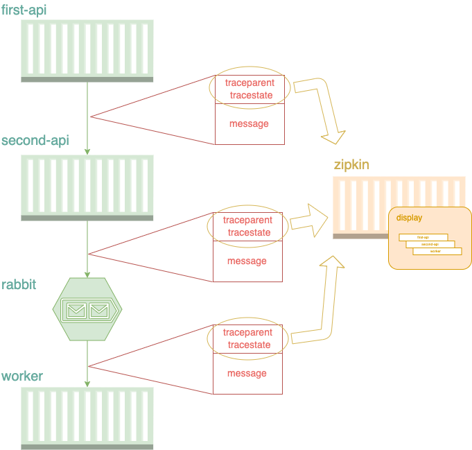

# [c#] Using W3C Trace Context standard in distributed tracing

In my last [article](https://dev.to/luizhlelis/using-w3c-trace-context-standard-in-distributed-tracing-3743), I wrote about the W3C trace context standard and what kind of problem it came to solve. The current article purpose is to show the trace context usage in a microservice architecture. For the first practical example, I chose to develop all applications using c# with `.NET 5` ([sample WeatherForecast web API](https://docs.microsoft.com/aspnet/core/tutorials/first-web-api?view=aspnetcore-5.0&tabs=visual-studio)) and run all of them locally via docker-compose. Hope you enjoy it!

## Application architecture

The main objective is to propagate a message with `traceparent` id throw two APIs and one worker using [W3C trace context](https://www.w3.org/TR/trace-context) standard. The `first-api` calls the `second-api` by a http call while the `second-api` has an asynchronous communication with the `worker` by a message broker ([rabbitmq](https://www.rabbitmq.com/) was chosen for that). Furthermore, [zipkin](https://zipkin.io/) was the trace system chosen (or `vendor` as the standard call it), being responsible for getting the application traces and building the distributed tracing diagram:

### <a name="firstfigure"></a>Figure 1 - Distributed trace



The first and second APIs have the [same code base](../src/OpenTelemetryApi), but they're being deployed in different containers.

## OpenTelemetry

An important framework used in the present article to deal with context propagation is [OpenTelemetry](https://opentelemetry.io/). As the documentation saids:

> OpenTelemetry is a set of APIs, SDKs, tooling and integrations that are designed for the creation and management of telemetry data such as traces, metrics, and logs.

[OTel](https://opentelemetry.io/docs/concepts/glossary/) provides a vendor-agnostic instrumentation library to generate, emit, collect, process and export telemetry data. That's not the only purpose of `OTel`, which is composed by multiple components: proto, specification, collector, instrumentation libraries. Due to the dense content of `OpenTelemetry`, I'll try to approach `OTel` in the current article in a shallow way, because that's a subject for another article.

`W3C TraceContext` is one of the [propagators](https://github.com/open-telemetry/opentelemetry-specification/blob/b46bcab5fb709381f1fd52096a19541370c7d1b3/specification/context/api-propagators.md#propagators-distribution) maintained and distributed as extension packages by `OTel`. That's the reason why `OTel` is always related to `W3C TraceContext` and vice versa.

## Talk is cheap, show me the code

> The source code could be found in [this github repo](https://github.com/luizhlelis/dotnet-trace-context).

The default diagnostics library in `.NET 5`, called [System.Diagnostics](https://docs.microsoft.com/en-us/dotnet/api/system.diagnostics?view=net-5.0), is already prepared to propagate the context based on W3C TraceContext specification. In previous `.NET Core` versions, the context was propagated with a [hierarchical identifier format](https://github.com/dotnet/runtime/blob/main/src/libraries/System.Diagnostics.DiagnosticSource/src/ActivityUserGuide.md#id-format) by default. On `.NET Core 3.0`, the identifier format setup started to be available, see [this](https://stackoverflow.com/questions/61251914/how-can-i-access-w3c-tracecontext-headers-in-a-net-core-3-1-application/67086305#67086305) stackoverflow question for more information about how to configure w3c's format in previous `.NET Core` versions.

The `first-api` and the `second-api` showed in [Figure 1](#firstfigure) requires three packages to work properly with `OpenTelemetry`:

``` csharp
    <PackageReference Include="OpenTelemetry.Extensions.Hosting" Version="1.0.0-rc2" />
    <PackageReference Include="OpenTelemetry.Instrumentation.AspNetCore" Version="1.0.0-rc2" />
    <PackageReference Include="OpenTelemetry.Exporter.Zipkin" Version="1.0.1" />
```

the `OpenTelemetry.Extensions.Hosting` package is responsible for register `OpenTelemetry` into the application using Dependency Injection, the `OpenTelemetry.Instrumentation.AspNetCore` and `OpenTelemetry.Exporter.Zipkin` packages represent two source components of `OpenTelemetry` framework: the instrumentation library and the collector, respectively. The [instrumentation library](https://opentelemetry.io/docs/concepts/instrumenting/) is responsible for inject the observable information from libraries and applications into the OpenTelemetry API. On the other hand, the [collector](https://opentelemetry.io/docs/concepts/data-collection/) offers a vendor-agnostic implementation on how to receive, process, and export telemetry data. The exporter is the place where to send the received data (`zipkin` was the chosen for our example). The `OTel`'s dependency injection was done in `Startup.cs`:

``` csharp
    services.AddOpenTelemetryTracing(builder => builder
        .SetResourceBuilder(ResourceBuilder.CreateDefault().AddService(Configuration["Zipkin:AppName"]))
        .AddZipkinExporter(o =>
            {
                o.Endpoint = new Uri(Configuration["Zipkin:Url"]);
            })
        .AddAspNetCoreInstrumentation()
    );
```

the `zipkin` endpoint that receives telemetry data is `/api/v2/spans`. As mentioned before, the `first-api` and the `second-api` have the [same code base](../src/OpenTelemetryApi). For this example, the first is called by a client (`curl`) in `WeatherForecast` route, which calls the second one in the `PublishInQueue` route. Both controller methods have a `stdout` print for `traceparent` and `tracestate`:

``` csharp
    [ApiController]
    [Route("[controller]")]
    public class WeatherForecastController : ControllerBase
    {
        private readonly ILogger<WeatherForecastController> _logger;
        private readonly IHttpClientFactory _httpClientFactory;
        private readonly IConfiguration _configuration;
        private readonly ConnectionFactory _connectionFactory;
        private readonly TextMapPropagator _propagator = Propagators.DefaultTextMapPropagator;

        public WeatherForecastController(
            ILogger<WeatherForecastController> logger,
            IHttpClientFactory httpClientFactory,
            IConfiguration configuration,
            ConnectionFactory connectionFactory)
        {
            _logger = logger;
            _httpClientFactory = httpClientFactory;
            _configuration = configuration;
            _connectionFactory = connectionFactory;
        }

        [HttpPost]
        public async Task<IActionResult> SendToTheOtherApi([FromBody] WeatherForecast weatherForecast)
        {
            _logger.LogInformation("Traceparent: {0}", Activity.Current.Id);
            _logger.LogInformation("Tracestate: {0}", Activity.Current.TraceStateString);
            var client = _httpClientFactory.CreateClient();
            var content = new StringContent(JsonConvert.SerializeObject(weatherForecast), Encoding.UTF8, "application/json");
            await client.PostAsync(_configuration["ClientUrl"], content);

            return Ok();
        }

        [HttpPost]
        [Route("PublishInQueue")]
        public IActionResult PublishInQueue([FromBody] WeatherForecast weatherForecast)
        {
            var message = JsonConvert.SerializeObject(weatherForecast);
            var body = Encoding.UTF8.GetBytes(message);
            var traceparent = Activity.Current.Id;
            var tracestate = Activity.Current.TraceStateString;
            _logger.LogInformation("Traceparent: {0}", traceparent);
            _logger.LogInformation("Tracestate: {0}", tracestate);

            using (var connection = _connectionFactory.CreateConnection())
            {
                using (var channel = connection.CreateModel())
                {
                    channel.QueueDeclare(
                        queue: _configuration["RabbitMq:QueueName"],
                        durable: false,
                        exclusive: false,
                        autoDelete: false,
                        arguments: null);

                    var basicProps = channel.CreateBasicProperties();

                    // Inject the ActivityContext into the message headers to propagate trace context to the receiving service.
                    var contextToInject = Activity.Current.Context;
                    _propagator.Inject(
                        new PropagationContext(contextToInject, Baggage.Current),
                        basicProps,
                        RabbitMqHelper.InjectTraceContextIntoBasicProperties);

                    RabbitMqHelper.AddMessagingTags(Activity.Current, _configuration);

                    channel.BasicPublish(
                        exchange: "",
                        routingKey: _configuration["RabbitMq:QueueName"],
                        basicProperties: basicProps,
                        body: body);
                }
            }

            return Ok();
        }
    }
```

Note that I chose to use a `propagator` to inject the context into a carrier. The `propagator`s are defined in the [Opentelemetry Specification](https://github.com/open-telemetry/opentelemetry-specification) as "objects used to read and write context data to and from messages exchanged by the applications". The spec also recommends that `propagators` must define `Inject` and `Extract` operations, as the main purpose of `PublishInQueue` is to publish a message, the `Inject` context operation suits better there, and the `Extract` operation in the `worker`.

Besides that, the propagation fields (`traceparent` and `tracestate`) were added in the message header. In the [last article](https://dev.to/luizhlelis/using-w3c-trace-context-standard-in-distributed-tracing-3743), I said that the [standard](https://w3c.github.io/trace-context-amqp/) (in the Working Draft (WD) step of the w3c process) recommends to add the propagation fields in the `application-properties` section by the message publisher. For the current example, I chose to propagate that context in the message header even for AMQP calls as was done in [the dotnet OpenTelemetry example](https://github.com/open-telemetry/opentelemetry-dotnet/blob/e3df42bfc15dc1d4dff01d655f669f7c27e35312/examples/MicroserviceExample/Utils/Messaging/MessageSender.cs#L78). It's important to reinforce that `Trace Context: AMQP protocol` is not a W3C Recommendation yet. Take a look at the place where the propagation fields were added:

```csharp
    public static void InjectTraceContextIntoBasicProperties(
        IBasicProperties props, string key, string value)
    {
        if (props.Headers == null)
        {
            props.Headers = new Dictionary<string, object>();
        }

        props.Headers[key] = value;
    }
```

By default, the `ASP.NET core` starts an `Activity` span when the [request is beginning](https://github.com/dotnet/aspnetcore/blob/main/src/Hosting/Hosting/src/Internal/HostingApplicationDiagnostics.cs#L59) and stop it [at the end](https://github.com/dotnet/aspnetcore/blob/main/src/Hosting/Hosting/src/Internal/HostingApplicationDiagnostics.cs#L156) for that reason this kind of setup is not required for the `first-api` and the `second-api`. On the other hand, the manually creation of an activity span is required for the `worker` because in that case, it's not dealing with http calls, neither an API, but a message listener.

> **_NOTE:_** `ASP.NET core` also sets the `traceparent` from the upstream request as [the current activity ParentId](https://github.com/dotnet/aspnetcore/blob/main/src/Hosting/Hosting/src/Internal/HostingApplicationDiagnostics.cs#L289).

For the `worker` those packages are required:

``` csharp
    <PackageReference Include="OpenTelemetry.Extensions.Hosting" Version="1.0.0-rc2" />
    <PackageReference Include="OpenTelemetry.Exporter.Zipkin" Version="1.0.1" />
```

and the `OTel`'s dependency injection was configured to the `worker` in `Program.cs` like the following bellow:

``` csharp
    services.AddOpenTelemetryTracing(config => config
        .SetResourceBuilder(ResourceBuilder
            .CreateDefault()
            .AddService(typeof(WorkerBackgroundService).Namespace))
        .AddSource(typeof(WorkerBackgroundService).Namespace)
        .AddZipkinExporter(o =>
        {
            o.Endpoint = new Uri(configuration["Zipkin:Url"]);
        })
    );
```

as mentioned before, for the `worker` was required to configure manually a new span scope for each message read:

```csharp
    public void MessageHandler(BasicDeliverEventArgs eventArgs)
    {
        // Extract the PropagationContext from the upstream service using message headers.
        var parentContext = _propagator.Extract(
            default,
            eventArgs.BasicProperties,
            RabbitMqHelper.ExtractTraceContextFromBasicProperties);
        Baggage.Current = parentContext.Baggage;

        using (var activity = _activitySource.StartActivity(
            _configuration["Zipkin:AppName"],
            ActivityKind.Consumer,
            parentContext.ActivityContext))
        {
            var body = eventArgs.Body.ToArray();
            var message = Encoding.UTF8.GetString(body);
            _logger.LogInformation("Received {0}", message);
            _logger.LogInformation("Traceparent: {0}", Activity.Current.Id);
            _logger.LogInformation("Tracestate: {0}", Activity.Current.TraceStateString);

            activity.SetTag("message", message);
            RabbitMqHelper.AddMessagingTags(activity, _configuration);
        }
    }
```

`MessageHandler` method is triggered when a new message arrives in the queue, so that's the queue listener. Note that a new span scope is created with `StartActivity` method and the most important thing is: how to configure the new span scope specifying which is the upstream span. The `_propagator` variable is of the type `TraceContextPropagator`, an [opentelemetry-dotnet](https://github.com/open-telemetry/opentelemetry-dotnet/blob/main/src/OpenTelemetry.Api/Context/Propagation/TraceContextPropagator.cs) class that is a text map propagator for W3C trace context. Most important parameter of `_propagator.Extract` method is the last one (called `getter`), that's the function which `OTel` will try to use to extract the propagation fields (`traceparent` and `tracestate`). Take a look at the way that `ExtractTraceContextFromBasicProperties` function was configured to the current example:

```csharp
    public static IEnumerable<string> ExtractTraceContextFromBasicProperties(IBasicProperties props, string key)
    {
        if (props.Headers.TryGetValue(key, out var value))
        {
            var bytes = value as byte[];
            return new[] { Encoding.UTF8.GetString(bytes) };
        }

        return Enumerable.Empty<string>();
    }
```

as you can see above, the `worker` is expecting the `traceparent` and `tracestate` in the message header.

## Running the project

Inside [src folder](./src), type the command below to up all containers (`first-api`, `second-api`, `worker`, `rabbit` and `zipkin`):

```bash
  docker-compose up
```

wait for all containers get on and then send a request to the `first-api`:

```bash
curl --request POST \
  --url http://localhost:5000/WeatherForecast \
  --header 'Content-Type: application/json' \
  --header 'accept: */*' \
  --data '{
	"temperatureC": 10,
	"summary": "Trace Test"
}'
```

the message that you sent above will travel throughout the flow (`first-api` > `second-api` >  `rabbit` > `worker`) along with the propagation fields (`traceparent` and `tracestate`). Take a look at the application `stdout`:

```log
first-api     | info: OpenTelemetryApi.Controllers.WeatherForecastController[0]
first-api     |       Traceparent: 00-0a0578c18192c14bae738b777e072a42-2db0e8c6b4654744-01
first-api     | info: OpenTelemetryApi.Controllers.WeatherForecastController[0]
first-api     |       Tracestate: (null)
second-api    | info: OpenTelemetryApi.Controllers.WeatherForecastController[0]
second-api    |       Traceparent: 00-0a0578c18192c14bae738b777e072a42-bfc08418aeb71a4e-01
second-api    | info: OpenTelemetryApi.Controllers.WeatherForecastController[0]
second-api    |       Tracestate: (null)
worker        | info: Worker.WorkerService[0]
worker        |       Traceparent: 00-0a0578c18192c14bae738b777e072a42-004468438f2d724c-01
worker        | info: Worker.WorkerService[0]
worker        |       Tracestate: (null)
```

note that the `trace-id` (`0a0578c18192c14bae738b777e072a42`) remains the same throughout all the trace, and the `span-id` (or `parent-id`) has been updated between the applications (`2db0e8c6b4654744`, `bfc08418aeb71a4e` and `004468438f2d724c`). To see the generated distributed tracing diagram, access `zipkin` in your browser:

```bash
  http://localhost:9411/
```

at home page, let the search field empty and type `RUN QUERY` to load all traces. Finally, click in your trace, then you'll see a diagram like this:


## Conclusion

The W3C Trace Context standard came to define a standard to the distributed tracing propagation. Currently, there is only one `W3C Recommendation` which is for HTTP calls (launched in february 2020), all the other standards are in the `working in process` step (AMQP, MQTT and baggage). It doesn't mean that you should avoid to use the standard in a production environment, but keep in mind that some things are going to change and is important to be up to date with newer releases.

If you got until here and liked the article content, let me know reacting to the current post. You can also open a discussion below, I'll try to answer soon. On the other hand, if you think that I said something wrong, please open an issue in the [article's github repo](https://github.com/luizhlelis/dotnet-trace-context). In the next article, I'll show a full distributed trace example in a microsservice architecture, just like this, but using `python` with `django`. Hope you like it!

## References

DRUTU, Bogdan; KANZHELEV, Sergey; MCLEAN, Morgan; MOLNAR, Nik; REITBAUER, Alois; SHKURO, Yuri. [W3C Recommendation - Trace Context](https://www.w3.org/TR/trace-context/)

KANZHELEV, Sergey; VASTERS, Clemens. [W3C Editor's draft - Trace Context: AMQP protocol](https://w3c.github.io/trace-context-amqp/)

OPENTELEMETRY, Community. [OpenTelemetry .NET](https://github.com/open-telemetry/opentelemetry-dotnet)

OPENTELEMETRY, Community. [OpenTelemetry Documentation](https://opentelemetry.io/docs/)

OPENTELEMETRY, Community. [OpenTelemetry Specification](https://github.com/open-telemetry/opentelemetry-specification)
